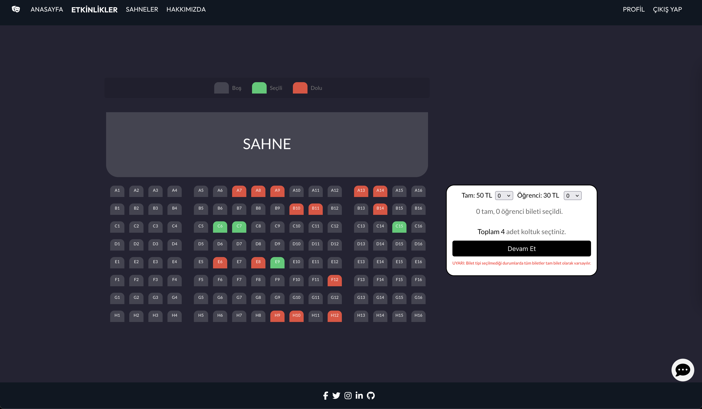
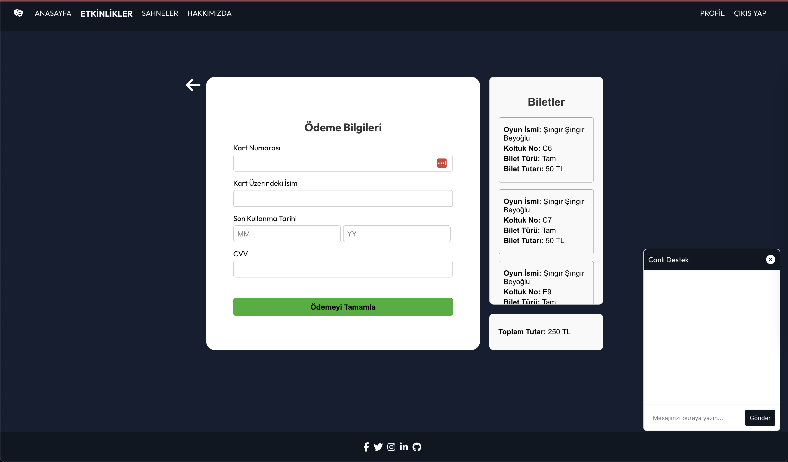

Backend için : Backend klasörü altında "npm install" > "node server.js"

Frontend için: Ana dizin altında: "npm install" > "npm start"

server.js dosyasında mongodb url'inizi ve mail gönderimi, mail adresi ve şifreyi .env dosyasına eklemeyi unutmayın.

  
  
